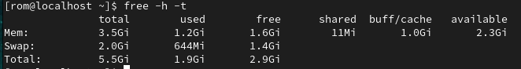
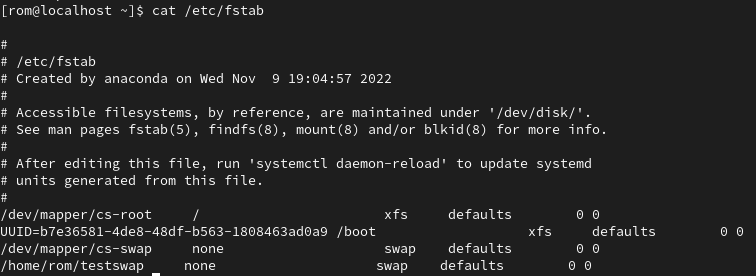
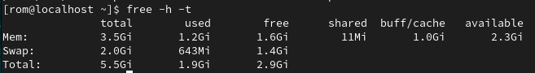
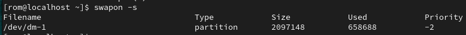
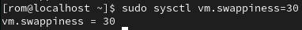
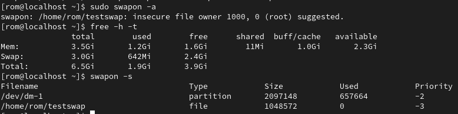
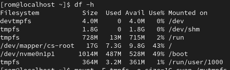
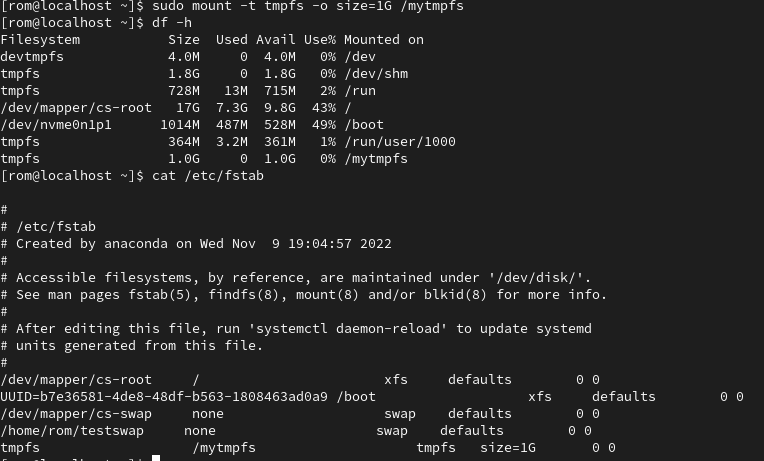

# Домашнее задание к занятию "Память, управление памятью "

---

### Задание 1

Что происходит с оперативной памятью во время перехода ПК в:
1) сон (suspend) *- данные остаются в оперативной памяти, ПК в режиме низкого энергопотребления, но включен*
2) гибернацию (hibernate) *- данные из оперативной памяти записываются в swap, ПК выключается*

*Приведите ответ для каждого случая в свободной форме.*

---

### Задание 2

В лекции не была упомянута одна известная команда для получения информации о нагрузке на компьютер и в частности  на ОЗУ.

Ее вывод выглядит примерно вот так:

*Как называется эта команда? Что такое si и so  в примере на картинке? *

*Приведите ответ в свободной форме.*

`vmstat`
si(swap in) — количество блоков в секунду, которое система считывает из раздела или файла swap в память;
so(swap out) — и наоборот, количество блоков в секунду, которое система перемещает из памяти в swap.

---

### Задание 3

Приведите 3 команды, которые выведут на экран следующее::

1) Архитектуру ПК
2) Модель процессора
3) Количество памяти, которая уже не используется процессами, но еще остается в памяти(ключевое слово - inactive).

*Примечание: при выполнении задания предполагается использование конструкции "{команда} | grep {параметр для фильрации вывода}"*

1) `lscpu | grep Architecture`
2) `lscpu | grep 'Model name'`
3) `cat /proc/meminfo | grep Inactive:`

---

### Задание 4

1) Создайте скрин вывода команды `free -h -t`

2) Создайте swap-файл размером 1Гб
3) Добавьте настройку чтобы swap-файл подключался автоматически при перезагрузке виртуальной машины (подсказка: необходимо внести изменения в файл `/etc/fstab`)

4) Создайте скрин вывода команды `free -h -t`

5) Создайте скрин вывода команды `swapon -s`

6) Измените процент свободной оперативной памяти, при котором начинает использоваться раздел подкачки до 30%. Сделайте скрин внесенного изменения.

Если всё-таки подключить этот новый swap файл (чего по заданию почему-то делать не нужно):

*В качестве ответа приложите созданные скриншоты*

---

## Дополнительные задания (со звездочкой*)
Эти задания дополнительные (необязательные к выполнению) и никак не повлияют на получение вами зачета по этому домашнему заданию. Вы можете их выполнить, если хотите глубже и/или шире разобраться в материале.

### Задание 5*

Найдите информацию про tmpfs.

*Расскажите в свободной форме, в каких случаях уместно использовать эту технологию.*

Создайте диск `tmpfs` (размер выберите исходя из объёма ОЗУ на ПК: 512Мб-1Гб), смонтируйте его в директорию `/mytmpfs`.

*В качестве ответа приведите скрин вывода команды df- h до и после монтирования диска tmpfs.*

Файловая система для размещения данных в виртуальном разделе на ОЗУ. Используется для хранения файлов, не сохраняемых при перезагрузке; можно размещать кеш каких-нибудь приложений.

