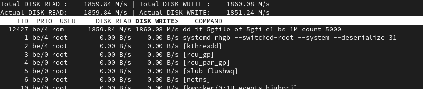

# Домашнее задание к занятию "Производительность системы. Часть 2."

------

### Задание 1.

Составьте задание через утилиту `cron` на проверку обьема кэша-обновлений еженедельно.

Кэш-обновлений - это обновления которые остаются после выполнения `apt update`, `apt upgrade`.

*Приведите ответ в виде команды.*

'0 0 * * 0 du -sch /var/cache/dnf/ > /home/rom/dnf_check'

------

### Задание 2.

- Запустите процесс копирования большого файла (1 Гб) на жесткий диск.
- Запустите команду `iostat`.
- Запустите `iotop`.

Какие процессы влияют на данные команды?

*Проведите развернутый ответ и приложите снимки экрана.*

Процессы, которые обращаются к диску.

------

### Задание 3.

Настройте приоритет использования `swap` в пропорции:

- 30/70;
- 
- 50/50;
- 
- 70/30.
- 

Запустите браузер и нагрузите память.

Проанализируйте результат.

*Проведите развернутый ответ и приложите снимки экрана.*

По идее с ростом параметра `swappiness` должно увеличиваться количество свободной памяти и увеличиваться использование swap. В реальности проверка с помощью браузера вносит смуту в эту теорию. Содержимое на сайтах динамическое и на каждом эксперименте получается не идентичная загрузка. Деятельность Роскомнадзора также не добавляет стабильности. Браузеры долго пытаются достучаться до "запрещённых" скриптов и поэтому загрузка памяти плавает с течением времени.

------

## Дополнительные задания (со звездочкой*)
Эти задания дополнительные (необязательные к выполнению) и никак не повлияют на получение вами зачета по этому домашнему заданию. Вы можете их выполнить, если хотите глубже и/или шире разобраться в материале.

### Задание 4.

Задание можно выполнить, если вы используете Linux на реальном железе. Можно установить программу `apt install cpufreq` и посмотреть настройки режимов процессора.

- Установите `cpufreq`;
- Выполните настройку на режим сохранения энергии;
- Выполните настройку полной производительности.

Сравните результаты.

*Проведите развернутый ответ и приложите снимки экрана.*
